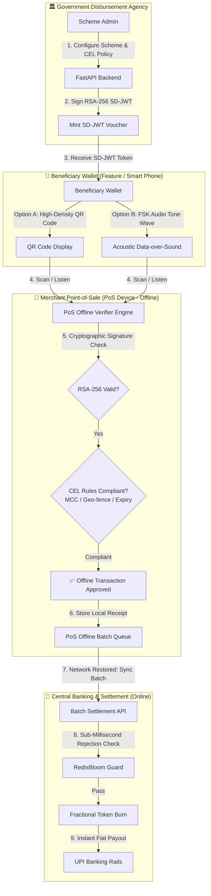

# Tokify ⚡

> **Hybrid DPI Orchestration Layer for Selective Disclosure JSON Web Tokens (SD-JWTs)**  
> Programmable, Privacy-Preserving Welfare Disbursement & Subsidies with Offline Point-of-Sale (PoS) Verification and Instant UPI Settlement.

[](https://datatracker.ietf.org/doc/html/rfc9524)
[](LICENSE)
[](https://fastapi.tiangolo.com)
[](https://react.dev)

---

## 📌 Executive Summary

Current direct welfare disbursement and subsidy systems suffer from three critical bottlenecks:
1. **Lack of Programmable Constraints**: Raw fiat transfers (DBT) can be diverted for non-intended purchases (e.g. non-agricultural goods).
2. **Static Voucher Limitations**: Legacy solutions like **e-RUPI** rely on static, single-use SMS strings lacking dynamic multi-variable rules, fractional spending, geo-fencing, or balance updates.
3. **The Last-Mile Offline Barrier**: Rural beneficiaries and Fair Price Shops frequently experience cellular network downtime. Online validation bottlenecks block delivery to vulnerable demographics.

**Tokify** introduces a **Hybrid DPI (Digital Public Infrastructure) Orchestration Layer** that issues subsidies as cryptographically signed **Selective Disclosure JSON Web Tokens (SD-JWTs, RFC 9524)**. Subsidies carry embedded policy constraints (Common Expression Language - CEL) verified **100% offline** on merchant Point-of-Sale (PoS) devices via **QR Codes** or **Acoustic Data-over-Sound** signals (enabling non-internet feature phones to transact securely).

---

## 📐 Architecture & Flowchart



---

## 🔑 Key Technological Innovations

### 1. Selective Disclosure (SD-JWT - RFC 9524)
Unlike traditional JWTs that expose all claims to any verifier, Tokify utilizes salted cryptographic disclosures (`_sd` array with `sha256` digests). Beneficiaries can present proof of eligibility and scheme authorization without revealing underlying sensitive identity or medical data to local merchants.

### 2. Embedded CEL (Common Expression Language) Policy Engine
Subsidies carry rich, multi-variable logic executed directly on PoS hardware:
```cel
mcc in ['5261', '5191'] && geo_distance_km(lat, lng, 28.6139, 77.2090) <= 50.0 && amount >= spend_request && now() <= exp
```
- **Merchant Category Code (MCC) Whitelisting**: Restricts spending exclusively to authorized merchant categories (e.g. fertilizer dealers).
- **Dynamic Geo-fencing**: Restricts voucher validity to target disaster relief zones or district coordinates.
- **Time-boxing & Expiration**: Hard expiration enforced down to the second.

### 3. Acoustic Data-over-Sound Protocol
For millions of rural citizens with standard feature phones (lacking NFC, Bluetooth, or mobile data), Tokify modulates the SD-JWT cryptographic signature into audible Frequency Shift Keying (**FSK**) audio tones. The beneficiary's feature phone micro-speaker plays the tone sequence, which is captured by the merchant PoS microphone for instant offline verification.

### 4. Sub-Millisecond Double-Spend Guard (RedisBloom)
When PoS devices reconnect to internet coverage and submit deferred transaction batches, Tokify checks token `JTI` + timestamp hashes against a high-throughput **RedisBloom** filter, rejecting duplicate redemptions in sub-milliseconds before triggering UPI settlement.

---

## 📊 Comparison Matrix

| Feature | NPCI e-RUPI | CBDC / Blockchain | **Tokify (SD-JWT DPI)** |
| :--- | :--- | :--- | :--- |
| **Programmability** | Single-use static SMS string | Smart contract on-chain | Dynamic CEL multi-variable rules |
| **Offline Verification** | ❌ Requires Online Telco validation | ❌ High latency / consensus bottleneck | ✅ **100% Offline Cryptographic Verification** |
| **Feature Phone Support** | Text SMS only | ❌ Requires smartphone | ✅ **Acoustic Data-over-Sound (FSK)** |
| **Privacy Protection** | Plaintext identity in SMS | Public ledger transparency | ✅ **RFC 9524 Selective Disclosure** |
| **Fractional Spending** | ❌ All-or-nothing voucher | Variable | ✅ **Fractional balance burning** |
| **National Scale Rails** | UPI rails | Custom node network | ✅ **Existing Fiat UPI Rails** |

---

## 💻 Tech Stack

- **Backend**: Python 3.11, FastAPI, PyJWT, Cryptography (RSA-256 / Ed25519), SQLAlchemy, Pytest.
- **Policy & Double-Spend**: CEL (Common Expression Language), Redis / RedisBloom.
- **Frontend Ecosystem**: React 18, Vite, Tailwind CSS, Lucide Icons, Web Audio API.
- **Containerization**: Docker, Docker Compose, PostgreSQL 16.

---

## ⚡ Quickstart Guide

### Prerequisites
- Python 3.10+
- Node.js 18+
- Git

### 1. Clone & Setup Repository
```bash
git clone https://github.com/Nabeelop/tokify.git
cd tokify
```

### 2. Run Backend API
```bash
cd backend
python -m venv venv
# On Windows:
.\venv\Scripts\activate
# On Linux/macOS:
source venv/bin/activate

pip install -r requirements.txt
python -m uvicorn app.main:app --reload --port 8000
```
- API Docs: `http://localhost:8000/docs`

### 3. Run Backend Unit Tests
```bash
cd backend
python -m pytest tests
```

### 4. Run Frontend Ecosystem
```bash
cd frontend
npm install
npm run dev
```
- Open `http://localhost:3000` in browser to launch the Government Dashboard and Merchant PoS App.

### 5. Run with Docker Compose
```bash
docker-compose up --build
```

---

## 🛣️ API Endpoints Summary

| Method | Endpoint | Description |
| :--- | :--- | :--- |
| `GET` | `/api/schemes` | List active welfare subsidy programs |
| `POST` | `/api/schemes` | Create new scheme with CEL policy rules |
| `POST` | `/api/tokens/mint` | Issue signed SD-JWT token for beneficiary |
| `POST` | `/api/tokens/verify` | Verify SD-JWT signature & CEL compliance |
| `POST` | `/api/settlement/batch` | Submit PoS offline transaction batch for UPI settlement |
| `GET` | `/api/settlement/ledger` | Fetch immutable settlement ledger |

---

## 📜 License

MIT License © 2026 Tokify Project. Built by Nabeel (`Nabeelop`).
