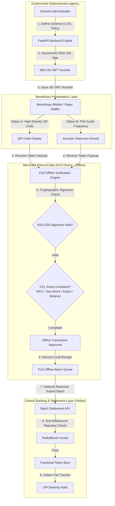

# Tokify

**Hybrid DPI Orchestration Layer for Selective Disclosure JSON Web Tokens (SD-JWTs)**  
Programmable, Privacy-Preserving Welfare Disbursement and Subsidies with Offline Point-of-Sale (PoS) Verification and Instant UPI Settlement.

---

## Executive Summary

Current direct benefit transfer (DBT) and subsidy disbursement systems face three primary structural bottlenecks:

1. **Lack of Programmable Constraints**: Traditional direct fiat transfers cannot enforce spending bounds, allowing funds to be diverted from intended categories (such as agricultural inputs or healthcare) to unauthorized purchases.
2. **Static Voucher Limitations**: Existing solutions such as e-RUPI rely on static, single-use SMS vouchers that lack dynamic multi-variable rules, fractional spending, merchant whitelisting, or geo-fencing capabilities.
3. **Last-Mile Connectivity Barriers**: Rural beneficiaries and Fair Price Shops regularly encounter cellular network downtime. Centralized online verification bottlenecks prevent delivery of essential welfare services in low-connectivity regions.

**Tokify** introduces a Hybrid Digital Public Infrastructure (DPI) Orchestration Layer. Subsidies are issued as cryptographically signed **Selective Disclosure JSON Web Tokens (SD-JWTs, RFC 9524)** embedded with Common Expression Language (CEL) policy rules. These vouchers can be verified **100% offline** on merchant Point-of-Sale (PoS) hardware via QR Codes or an **Acoustic Data-over-Sound** protocol for feature phones, before undergoing deferred batch settlement over national banking rails (UPI).

---

## Architecture and Workflow



---

## Technical Specifications

### 1. Selective Disclosure (SD-JWT - RFC 9524)
Standard JWTs expose all internal claims to any verifier. Tokify implements RFC 9524 salted disclosures (`_sd` array containing SHA-256 digests). Beneficiaries can present proof of subsidy authorization to local merchants without disclosing sensitive personal identity attributes.

### 2. Embedded Policy Engine (Common Expression Language)
Vouchers encode multi-variable policy logic that executes deterministically on PoS hardware without network connectivity:

```cel
mcc in ['5261', '5191'] && geo_distance_km(lat, lng, 28.6139, 77.2090) <= 50.0 && spend_request <= remaining_balance && now() <= exp
```

- **Merchant Category Code (MCC) Whitelisting**: Restricts redemptions strictly to approved vendor categories.
- **Geospatial Fencing**: Restricts voucher validity to designated administrative districts or relief zones.
- **Temporal Constraints**: Enforces hard expiration bounds down to second-level precision.
- **Fractional Spending**: Tracks cumulative partial redemptions against the token balance.

### 3. Acoustic Data-over-Sound Protocol
For feature phone users lacking NFC, Bluetooth, or mobile data, Tokify modulates the SD-JWT cryptographic signature into audible Frequency Shift Keying (FSK) audio tones. The feature phone speaker plays the audio sequence, which is captured and decoded by the merchant PoS microphone for offline verification.

### 4. High-Throughput Double-Spend Guard (RedisBloom)
When PoS devices reconnect to cellular networks and transmit accumulated batch receipts, Tokify validates token identifier (`jti`) and redemption nonces against a **RedisBloom** filter, rejecting duplicate spending attempts in sub-milliseconds prior to executing financial settlement.

---

## Architecture Comparison

| Architectural Dimension | NPCI e-RUPI | Blockchain / CBDC | Tokify (SD-JWT DPI) |
| :--- | :--- | :--- | :--- |
| **Policy Engine** | Static single-use SMS code | On-chain smart contract | Deterministic CEL policy rules |
| **Offline Validation** | Requires online Telco authorization | High latency / network dependency | 100% Offline Cryptographic & CEL Verification |
| **Low-Cost Hardware Support** | SMS Text string only | Requires smartphone & data | Acoustic Data-over-Sound (FSK) & QR Code |
| **Privacy Model** | Plaintext identity attributes | Public ledger transparency | RFC 9524 Selective Disclosure |
| **Partial Redemption** | Single-use non-fractional | Fractional balance | Dynamic fractional token burning |
| **Settlement Interoperability**| Dedicated voucher settlement | Custom node infrastructure | Native integration with UPI fiat rails |

---

## Technical Stack

- **Backend Architecture**: Python 3.11, FastAPI, PyJWT, Cryptography (RSA-256), SQLAlchemy, Pytest.
- **Policy & Double-Spend Engine**: Common Expression Language (CEL), Redis, RedisBloom.
- **Frontend Ecosystem**: React 18, Vite, Tailwind CSS, Lucide Icons, Web Audio API.
- **Infrastructure & Deployment**: Docker, Docker Compose, PostgreSQL 16.

---

## Installation and Setup

### Prerequisites
- Python 3.10 or higher
- Node.js 18 or higher
- Git

### 1. Repository Setup
```bash
git clone https://github.com/Nabeelop/tokify.git
cd tokify
```

### 2. Backend Service Setup
```bash
cd backend
python -m venv venv

# Windows PowerShell:
.\venv\Scripts\activate

# Linux / macOS:
source venv/bin/activate

pip install -r requirements.txt
python -m uvicorn app.main:app --reload --port 8000
```
Access OpenAPI documentation at `http://localhost:8000/docs`.

### 3. Backend Test Suite Execution
```bash
cd backend
python -m pytest tests
```

### 4. Frontend Application Setup
```bash
cd frontend
npm install
npm run dev
```
Access the application at `http://localhost:3000`.

### 5. Docker Deployment
```bash
docker-compose up --build
```

---

## Primary API Reference

| HTTP Method | Endpoint | Description |
| :--- | :--- | :--- |
| `GET` | `/api/schemes` | Retrieve active welfare subsidy programs |
| `POST` | `/api/schemes` | Create welfare scheme with embedded CEL policy rules |
| `POST` | `/api/tokens/mint` | Mint signed SD-JWT subsidy voucher and trigger SMS dispatch |
| `POST` | `/api/tokens/verify` | Verify SD-JWT signature and CEL policy compliance |
| `POST` | `/api/settlement/batch` | Process offline PoS batch receipts for UPI settlement |
| `GET` | `/api/settlement/ledger` | Query master settlement ledger |

---

## License

Distributed under the MIT License. Copyright (c) 2026 Tokify Project.
